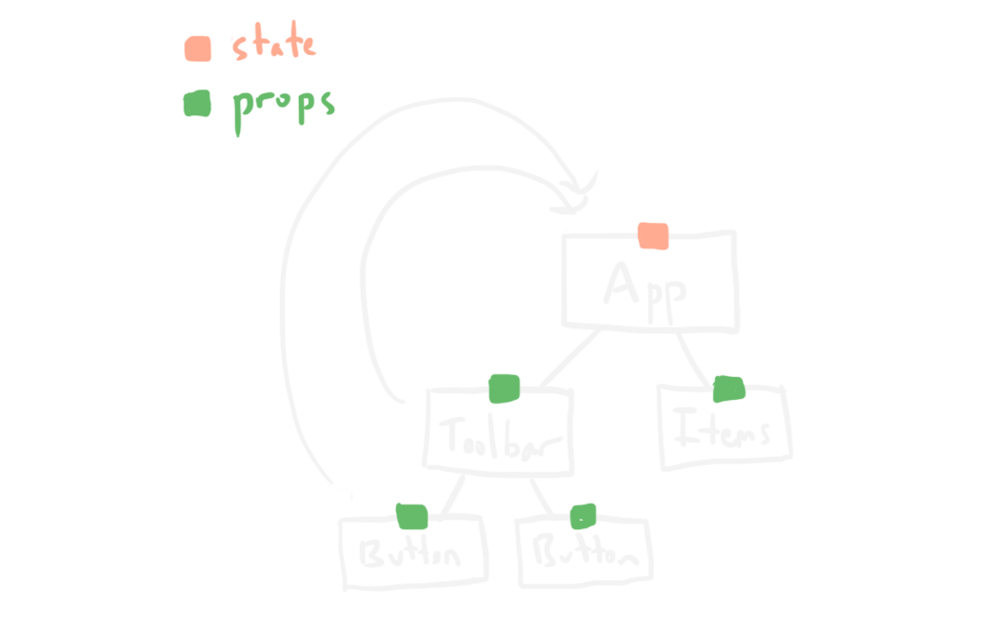
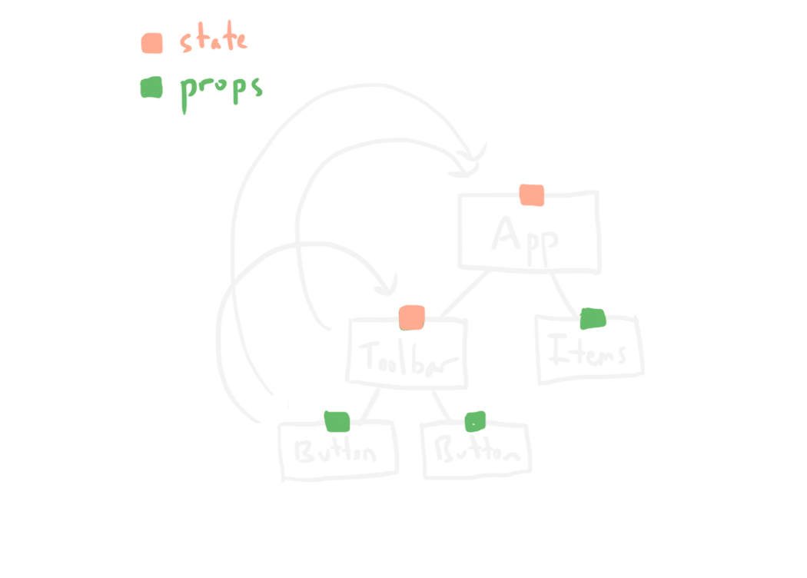
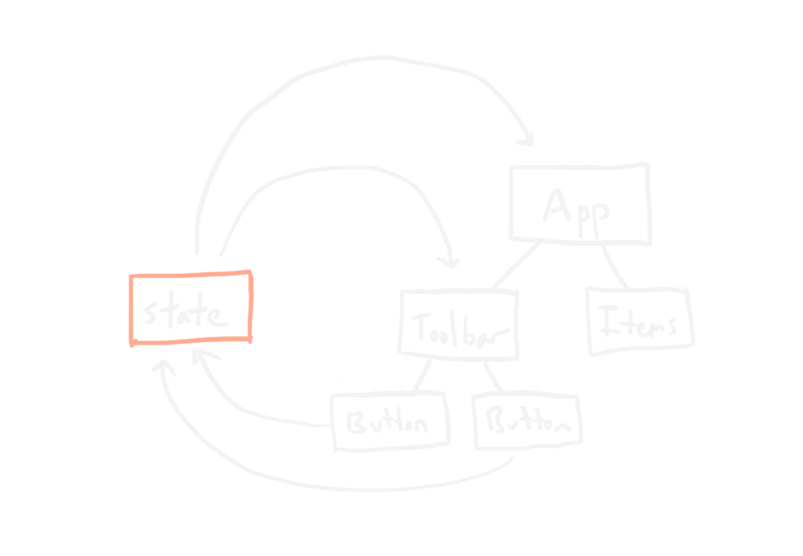
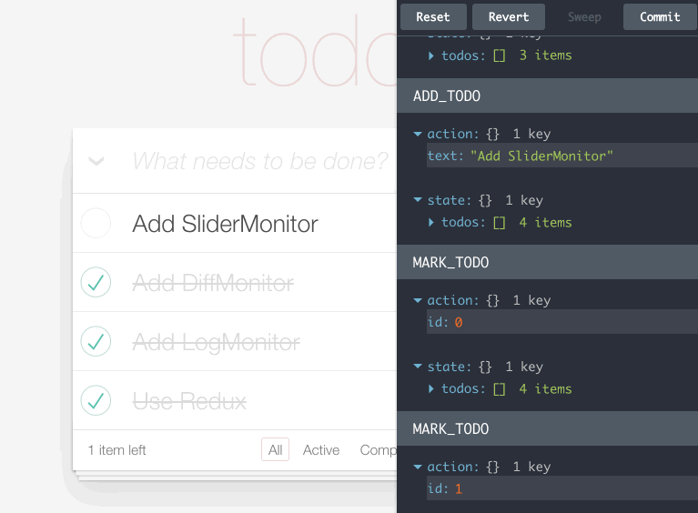
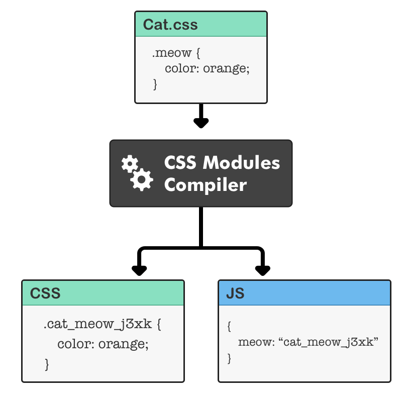

# [fit] **React II**
## Beyond the Comfort Zone

---
# Introduction

^ Tonight we'll discuss the eco-system around the JavaScript library "React".
- React is often billed as the "V" in "MVC".
- There are other library's that seek to fill the void of the "M" and the "C"
- React can also be looked at as a paradigm all it's own
- We'll also talk about some modern front end tooling.

---
## Audience & Assumptions

^ I'm going to have to make some assumptions about the audience. However, if you aren't yet familiar with these things, that's okay. This is going to be a whirlwind tour, and the slides aren't going to be code heavy at all. I'll save that for the workshop.

- You know HTML, CSS, and JavaScript.
- You have some familiarity with ES2015+ (ES6, etc.).
- You're a novice with React.

---
## Expectations & Outcomes

^ At the end of this, you should walk away with some exposure to the tools & concepts we talk about. Even if you're not already familiar with ES2015, React, etc. exposure is great way to start making sense of all this wacky stuff. In a little while, we'll build a small application using some of the tools we talk about for the next little bit.

---
# **React**

## [fit] A JAVASCRIPT LIBRARY FOR BUILDING USER INTERFACES


---


^ This interface has a number of components, let's decide what some of them might be:
- Panel
- Title
- UnitList
- UnitItem
- Button
- Progress Bar

^ There's also some data we can see used in multiple places, like the number of units, etc.

---
## Best Practices for State Management

---


^ A single component has some kind of state, event's inside that component that result in state changes cause that component's presentation to be updated.

---


^ Data flows down, Events flow up

---


^ This idea of "one way data flow" can begin and end at many different levels of our component tree. But things can start to get confusing. In a big app, a lot of wire has to start being strung to make things work.

---


^ At some point, we'll find we need to separate the idea of state completely. This is where the ideas of "Flux" comes in.

---
# **Advanced State Management**


^ At a certain point, as our applications grows in complexity, state can start to outgrow what's reasonable to manage in React alone.

---
## Flux Architecture


^ https://facebook.github.io/flux/

^ > Flux is the application architecture that Facebook uses for building client-side web applications. It complements React's composable view components by utilizing a unidirectional data flow. It's more of a pattern rather than a formal framework...

---


^ Conceptually, this is it. On the surface it look's pretty simple, but Facebook's implementation is rather complex.

---
## Redux

^ Today, this is almost the defacto choice for doing complex state in React. One of the largest criticism of it however is how boilerplately, and redundant a lot of code can feel. Idiomatic Redux often has you touching 3 or 4 files to implement even the most basic actions.


---



^ Amazing developer experience though, once you get your head around it.

---
## MobX

^ bills itself as Simple, scalable state management
^ https://github.com/mobxjs/mobx


---


---
## Cerebral

^ With Cerebral, you define the state of your application as a single model: a single state tree. Unlike MobX, and Redux, where you _can_ do this, this is a strict principle of Cerebral.
  - Uses familiar "MVC" concepts
  - Actions are called "Signals"
  - http://www.cerebraljs.com/


---
# **Tooling**

---

### Babel & ES2015+


^ Babel transforms your JavaScript. You put JavaScript in and get JavaScript out.

---

```JavaScript


        // ES2015
        [1,2,3].map(n => n + 1)

        // ES5
        [1,2,3].map(function(n) {
          return n + 1;
        })
```

---
# **Organizing Stylesheets**

^ I imagine a lot of us have felt the pain of working with large amounts of CSS in a big app. Finding out something isn't working because some style somewhere else is affecting


---
## Traditional


^ Yes, at this point, Sass, Less and other pre-processors are what we'd call "Traditional" ways of doing Styling.
- SASS
- Less
- PostCSS (Autoprefixer, etc.)

^ Let us use variables, write less code: via mixins or even just syntactic sugar.

---
## CSS Modules

^ We've invented things like BEM (Block Element Modifier) and SMACCS (Scalable and Modular Architecture for CSS). These
are frameworks for organizing CSS that can get so complicated, entire books have been written to explain them. I sat through a SMACSS workshop and I still don't get it.

^ https://en.bem.info
^ https://smacss.com

^ https://glenmaddern.com/articles/css-modules

CSS in files where all class names and animation names are scoped locally by default


---


^ We'll talk about this a bit more in-dept, this is the technique we'll be using in our workshop.

---
## Inline Styles

^ In react, this can mean CSS _in your JavaScript_. It's not as gross as it sounds. In fact, it can be kind of awesome.
^ Once we accept the reasoning behind using CSS modules, which is pretty sounds, "inline styles" starts to make sense.
^ It comes down to a method of styling that's akin to functional programming, with no side-effects.
^ The results don't _need_ to actually be inline. Our build system can build stylesheets limited to the CSS that's actually in the JavaScript components we're using.

- https://github.com/FormidableLabs/radium

---
## Yeah CSS!


---
# **Workshop**

---
# **Credits**

## Sources for Images

^ Many images shamelessly stolen from:

- http://nicolashery.com/describing-ui-state-with-data/
- http://jlongster.com/s/debugger-refactor/
- http://andrewhfarmer.com/what-are-css-modules/
- https://code-cartoons.com/a-cartoon-guide-to-flux-6157355ab207
